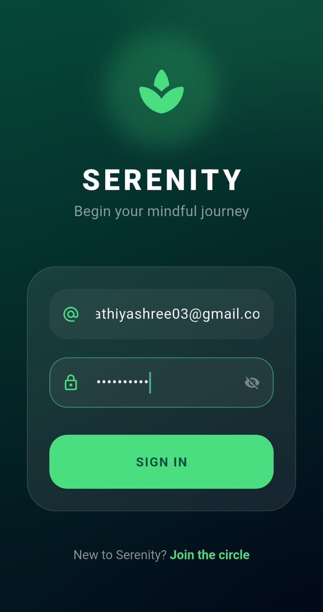
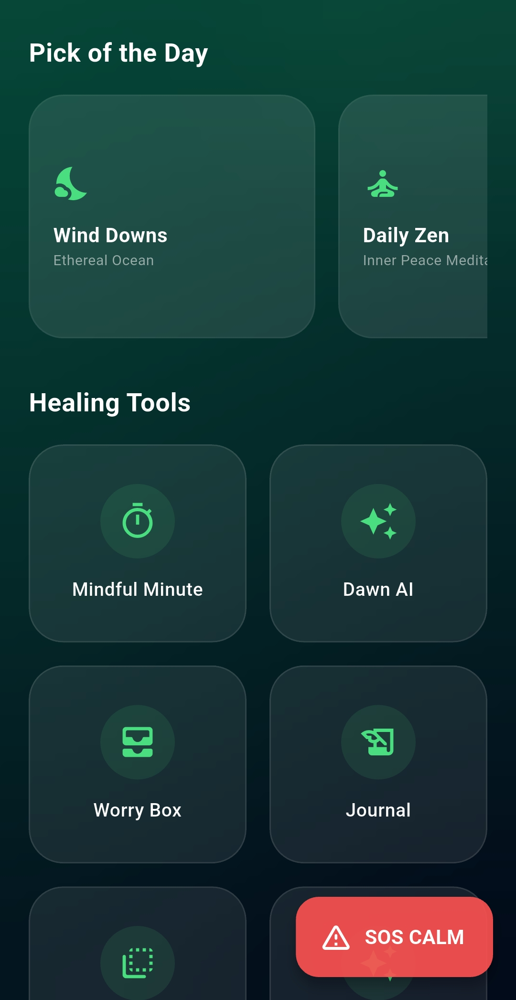
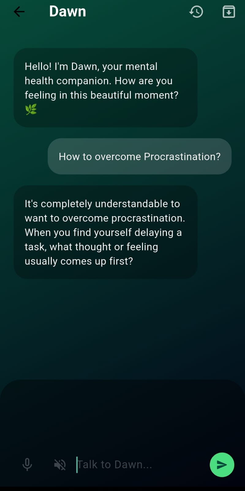
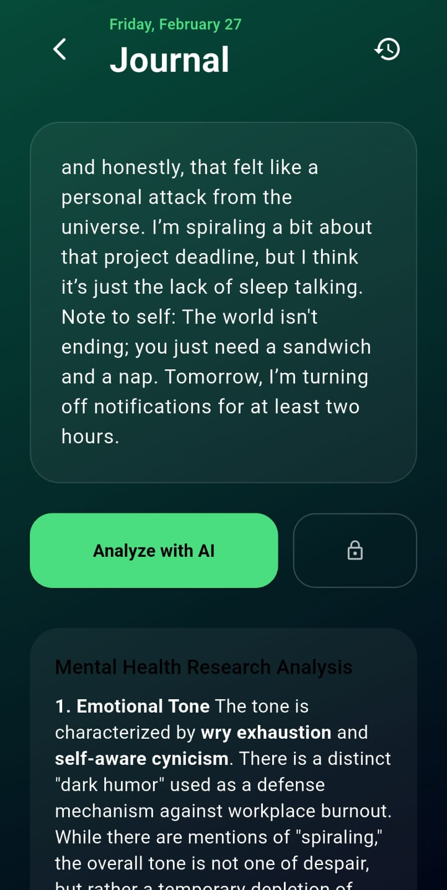
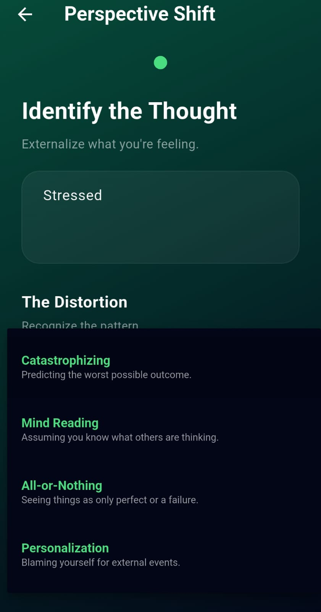
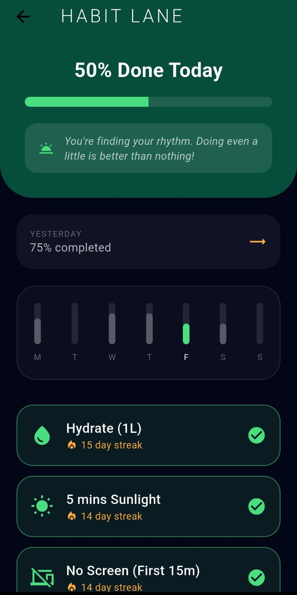

# Serenity – AI-Powered Mental Health Support System


Serenity is an AI-powered mental health support mobile application designed to promote emotional well-being through mood tracking, psychological assessments, AI-based conversation, and wellness habit reinforcement. The system integrates evidence-based mental health techniques with cloud-based infrastructure to provide continuous emotional support.

The application is developed using **Flutter**, integrated with **Firebase**, and enhanced with AI capabilities using the **Gemini API**.

---

Example placeholder:

```
/demo/serenity-demo.gif
```

---

## App Screenshots

| Login                           |  
| ------------------------------- |
|  |


| Dashboard                               |
| --------------------------------------- |
|  |

| AI Chatbot                          |
| ----------------------------------- |
|  |


| Journal Analysis                    |
| ----------------------------------- |
|  |


| Perspective Shift                                 | 
| ------------------------------------------------- | 
|  | 


| Habit Tracker                   |
| ------------------------------- |
|  |
---

# Features

### User Authentication

Secure login and registration using Firebase Authentication.

### Mood Tracking

Daily emotional logging with trend visualization.

### AI Chatbot

Conversational AI support providing empathetic responses and coping strategies.

### AI Smart Journal

Reflective journaling with AI-generated emotional insights and mood scoring.

### Psychological Assessments

Includes standardized screening tools such as:

* PHQ-9 (Depression)
* GAD-7 (Anxiety)
* Stress scale
* OCD screening
* ADHD screening
* Burnout evaluation
* Bipolar disorder screening
* PTSD screening
* Eating disorder screening

### Perspective Shift Tool

CBT-inspired cognitive reframing tool that helps users restructure negative thoughts.

### Gratitude Jar & Emotional Mirror

Encourages positive reflection and emotional awareness.

### Habit & Health Tracker

Tracks daily routines such as medication reminders, sleep schedules, and wellness activities.

### Zen Library

Curated mental wellness resources including meditation, breathing exercises, and educational content.

### Crisis Support

Direct access to verified mental health helplines.

---

# System Architecture

```
           +----------------------+
           |   Flutter Mobile App |
           +----------+-----------+
                      |
                      v
           +----------------------+
           | Firebase Authentication |
           +----------+-----------+
                      |
                      v
           +----------------------+
           | Cloud Firestore DB   |
           +----------+-----------+
                      |
                      v
           +----------------------+
           |    Gemini AI API     |
           +----------------------+
```

This architecture ensures secure authentication, real-time data storage, and AI-driven interactions.

---

# Technologies Used

Frontend
Flutter
Dart

Backend
Firebase Authentication
Cloud Firestore

AI Integration
Gemini API

Development Tools
Visual Studio Code
Gradle Build System

---

# Installation (Developers)

Clone the repository

```bash
git clone https://github.com/sathiya-shree/Serenity-mental-health-app.git
```

Navigate to project folder

```bash
cd Serenity-mental-health-app
```

Install dependencies

```bash
flutter pub get
```

Run the application

```bash
flutter run
```

---

# APK Download

The Android APK is available in the **Releases** section.

Download here:
[https://github.com/sathiya-shree/Serenity-mental-health-app/releases](https://github.com/sathiya-shree/Serenity-mental-health-app/releases)

APK Information

App Name: Serenity
Platform: Android
Minimum Android Version: Android 7.0+
Build Type: Release APK

Installation Steps:

1. Download the APK from Releases
2. Transfer it to your Android device
3. Enable installation from unknown sources
4. Install and launch the app

---

# Future Improvements

* Wearable device integration
* Voice-based emotion detection
* Therapist consultation integration
* Multilingual AI chatbot
* Personalized mental health insights

---

# Disclaimer

Serenity is designed for educational and self-care purposes. It does not replace professional mental health treatment.

---

# Author

Sathiya Shree

Final Year Project – AI-Based Mental Health Support System

GitHub Repository
[https://github.com/sathiya-shree/Serenity-mental-health-app](https://github.com/sathiya-shree/Serenity-mental-health-app)

---

MIT License

Copyright (c) 2026 Sathiya Shree

Permission is hereby granted, free of charge, to any person obtaining a copy
of this software and associated documentation files (the “Software”), to deal
in the Software without restriction, including without limitation the rights
to use, copy, modify, merge, publish, distribute, sublicense, and/or sell
copies of the Software, and to permit persons to whom the Software is
furnished to do so, subject to the following conditions:

The above copyright notice and this permission notice shall be included in all
copies or substantial portions of the Software.

THE SOFTWARE IS PROVIDED “AS IS”, WITHOUT WARRANTY OF ANY KIND, EXPRESS OR
IMPLIED, INCLUDING BUT NOT LIMITED TO THE WARRANTIES OF MERCHANTABILITY,
FITNESS FOR A PARTICULAR PURPOSE AND NONINFRINGEMENT. IN NO EVENT SHALL THE
AUTHORS OR COPYRIGHT HOLDERS BE LIABLE FOR ANY CLAIM, DAMAGES OR OTHER
LIABILITY, WHETHER IN AN ACTION OF CONTRACT, TORT OR OTHERWISE, ARISING FROM,
OUT OF OR IN CONNECTION WITH THE SOFTWARE OR THE USE OR OTHER DEALINGS IN THE
SOFTWARE.
